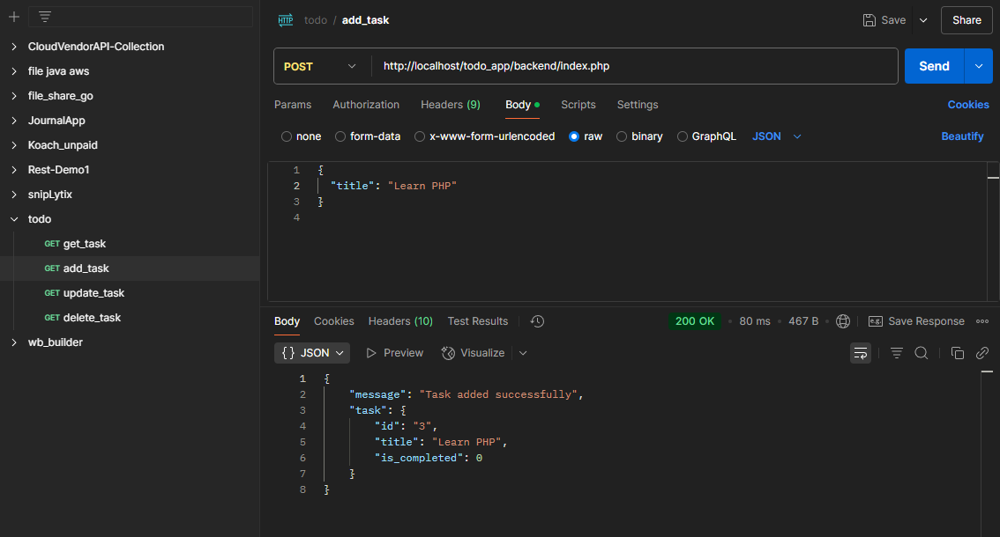
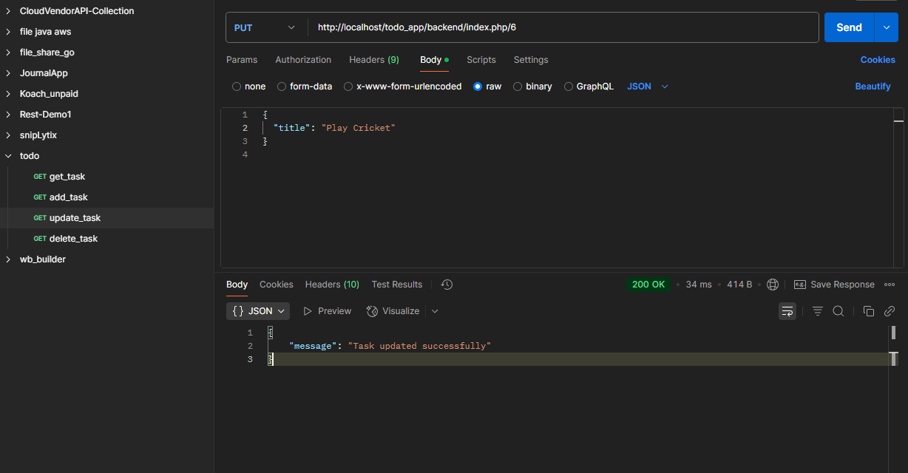
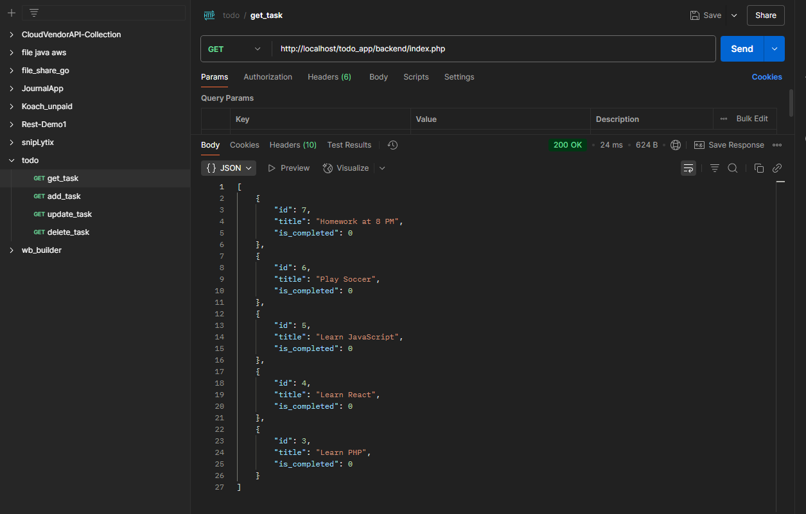
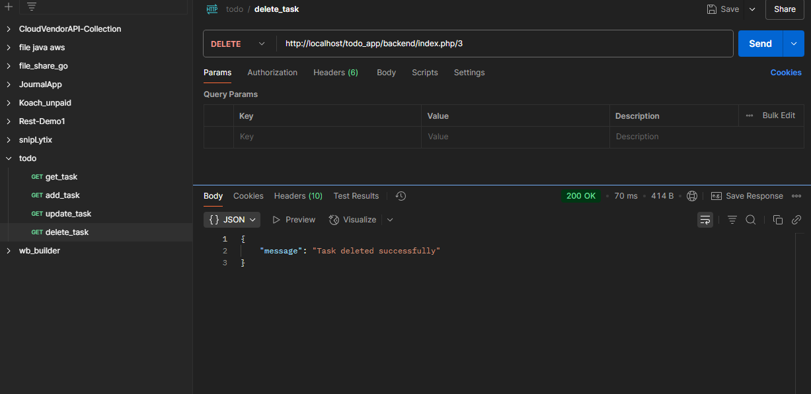
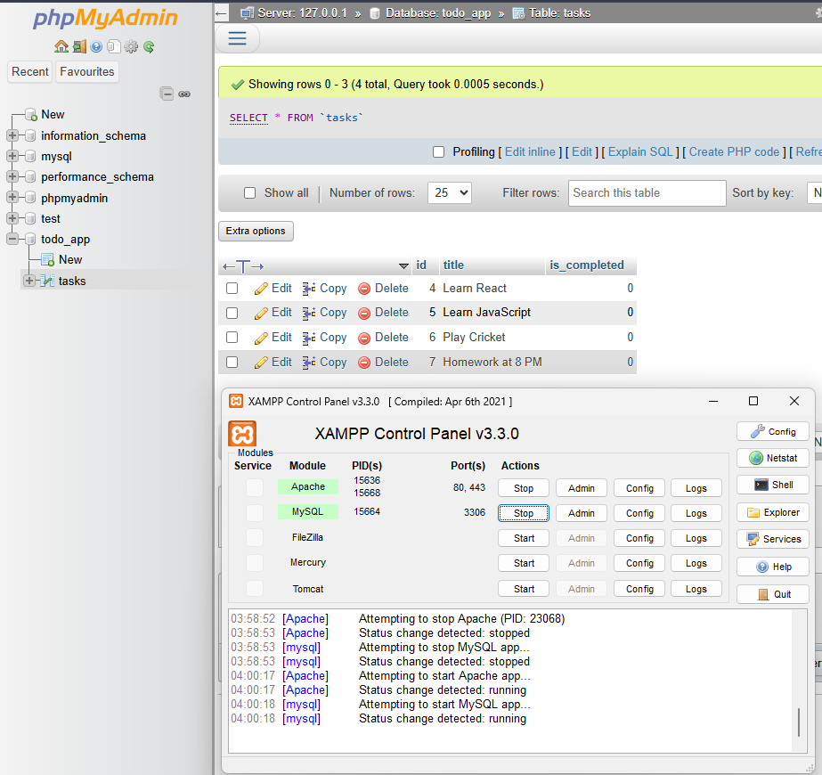

# CRUD Operation with php
A simple to-do list to manage your daily tasks, built with PHP and react

# Screenshots 

# 1. Adding task

# 2. updating task

# 3. getting task

# 4. Deleting task

# 5. phpmyadmin
